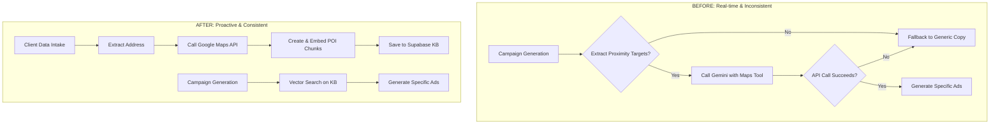

# Plan: Integrating Google Maps into the Ad Agency Knowledge Base

**Objective**: Decouple the real-time Google Maps API dependency from the `campaign-service` and move it into the `ad-agency-kb` service. This will pre-process location data during client intake, storing Points of Interest (POIs) as vector embeddings in the Supabase knowledge base. This ensures all proximity campaigns have consistent, high-quality location data, improving performance and reliability.

---

## 1. Current Architecture Analysis

The current system design creates inconsistent results for "Proximity Search" campaigns.

-   **Service**: `campaign-service`
-   **Trigger**: Real-time, during campaign generation (`/api/campaigns/real-estate/generate`).
-   **Execution Flow**:
    1.  **Data Extraction**: The `extractProximityTargets` function in `generate/route.ts` attempts to find location-based keywords (e.g., "near", "close to") within the client's existing text chunks.
    2.  **Conditional API Call**: Only if these keywords are found, a `google_maps_places_query` tool is made available to the Gemini model.
    3.  **Inconsistent Results**: If the client's uploaded documents are not rich with specific proximity language, the extraction fails, the Google Maps tool is not used, and the campaign falls back to generic headlines like "Prime Fort Myers Living."
-   **Primary Flaw**: The system is reactive and dependent on inconsistent client data quality. It doesn't proactively enrich the client's knowledge base with valuable location context.

## 2. Proposed Architecture

The new architecture will be proactive, enriching the knowledge base at the point of data ingestion.

-   **Service**: `ad-agency-kb`
-   **Trigger**: One-time, during client data processing (`/api/process`).
-   **Execution Flow**:
    1.  **Address Identification**: When client data is submitted (via form or document upload), the system will identify the client's physical property address.
    2.  **One-Time POI Lookup**: A new dedicated service module will call the Google Maps Places API to find nearby POIs across key categories (e.g., landmarks, schools, shopping, transit).
    3.  **Chunk & Embed**: Each discovered POI will be formatted into a descriptive sentence (e.g., "The property is near Bell Tower Shops."). These sentences will be treated as new, high-value text chunks.
    4.  **Store in Knowledge Base**: These new chunks will be converted into vector embeddings and stored in the `chunks` table in Supabase, linked to the `client_id`. They will be naturally classified as `local_area` chunks.
-   **Result**: The `campaign-service` no longer needs a live Google Maps integration. Its vector searches will now seamlessly pull the rich, pre-processed POI data, ensuring all proximity campaigns are specific and accurate.

### Data Flow Diagram

---

## 3. Implementation Plan

### Phase 1: `ad-agency-kb` Service Enhancement

1.  **Environment Setup**:
    -   Add `GOOGLE_MAPS_API_KEY` to the environment variables for the `ad-agency-kb` service.

2.  **Schema Enhancement**:
    -   Update the `client_intake` table to include a structured `address` field (e.g., `street`, `city`, `state`, `zip_code`). This ensures we have a reliable address for the Google Maps lookup. A migration script will be required.

3.  **Create Google Maps Service (`ad-agency-kb/src/lib/gmaps.ts`)**:
    -   Develop a new module to handle all communication with the Google Maps Places API.
    -   It will export a primary function, `findNearbyPOIs(address: string)`, which will search for a predefined set of place types (e.g., `shopping_mall`, `park`, `school`).

4.  **Update Data Processing API (`ad-agency-kb/src/app/api/process/route.ts`)**:
    -   Modify the `POST` handler to include a new step after initial text extraction.
    -   Check if an address is present in the intake data.
    -   If an address exists, invoke the new `gmaps.ts` service.
    -   Iterate through the returned POIs, format them into descriptive strings, and add them to the array of text content to be chunked and embedded.
    -   This ensures location data is processed and stored in the same way as all other client information.

### Phase 2: `campaign-service` Simplification

1.  **Remove Google Maps Tool**:
    -   In `campaign-service/src/app/api/campaigns/real-estate/generate/route.ts`, remove the `google_maps_places_query` and its associated `callGoogleMapsAPI` helper function from the Gemini model initialization. The model will no longer need to perform live API calls.

2.  **Rely on Enhanced Knowledge Base**:
    -   The existing `extractProximityTargets` function will now automatically discover the high-quality POI data from the vector search results. No changes to this function are necessary; it will simply have better data to work with.

3.  **Environment Cleanup**:
    -   Remove the `GOOGLE_MAPS_API_KEY` from the `campaign-service` environment, as it is no longer needed there.

---

## 4. Success Criteria

-   Proximity campaigns for any client with a valid address consistently generate specific, location-based headlines.
-   The real-time dependency on the Google Maps API during campaign generation is fully eliminated from the `campaign-service`.
-   The `ad-agency-kb` is the single source of truth for all client knowledge, now including pre-processed, structured location data.
-   A noticeable improvement in the speed and reliability of proximity campaign generation.

This plan provides a clear path to a more robust, efficient, and consistent system. Please review and approve to proceed with implementation. 